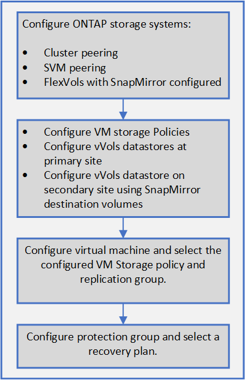

= VVOLデータストアのレプリケーションを設定します
:allow-uri-read: 
:icons: font
:imagesdir: ../media/

[role="lead"]
VVOLデータストアのレプリケーションは、VSC、VASA Provider、SRA仮想アプライアンスを使用して設定できます。VVOL レプリケーションの主な目的は、 VMware Site Recovery Manager （ SRM ）を使用してディザスタリカバリ時に重要な仮想マシンを保護することです。

ただし、VSC、VASA Provider、SRA仮想アプライアンスにvVolレプリケーションを設定するには、VASA Provider機能とvVolのレプリケーションを有効にする必要があります。VASA Providerは、VSC、VASA Provider、SRA仮想アプライアンスでデフォルトで有効になります。アレイ・ベースのレプリケーションは FlexVol レベルで実行されます各 VVOL データストアは、 1 つ以上の FlexVol で構成されるストレージコンテナにマッピングされます。FlexVol ボリュームには、 ONTAP から SnapMirror を事前に設定しておく必要があります。

[NOTE]
====
保護されている仮想マシンと保護されていない仮想マシンを 1 つの vVol データストアに混在させないでください。フェイルオーバー後の再保護処理では、保護されていない原因仮想マシンが削除されます。レプリケーションを使用するときは、 VVOL データストア内のすべての仮想マシンが保護されていることを確認してください。

====
各 FlexVol ボリュームについて、 VVOL データストアの作成ワークフローでレプリケーショングループが作成されます。VVOL レプリケーションを使用するには、ストレージ機能プロファイルに加え、レプリケーションのステータスとスケジュールを含む仮想マシンストレージポリシーを作成する必要があります。レプリケーショングループには、ディザスタリカバリの一環としてターゲットサイトにレプリケートされる仮想マシンが含まれます。レプリケーショングループは、 DR ワークフロー用の SRM コンソールを使用して、保護グループとリカバリプランを使用して設定できます。

[NOTE]
====
VVOL データストアのディザスタリカバリを使用する場合は、 VASA Provider の機能が拡張されて VVOL のレプリケーションが可能になったため、 Storage Replication Adapter （ SRA ）を別途設定する必要はありません。

====

